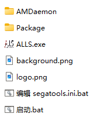

# 🌟 ALLS HX2 Launcher 使用说明

## 🧩 简介

**ALLS HX2 Launcher** 是为 **ALLS HX2 游戏环境** 设计的全屏启动引导程序，旨在提供一致的初始化体验。  
启动器将自动播放多阶段加载流程，自动查找并执行启动脚本，启动完成后自动退出。

---

## 🎯 功能特点

- 🖥️ 全屏无边框界面，**始终保持置顶显示**
- 🖼️ 支持自定义 **LOGO（`logo.png`）** 和 **背景图（`background.png`）**
- 🔄 动态加载动画与分阶段提示文本
- 🧠 自动查找并执行目录下的 `start.bat` 或 `启动.bat`
- ⏳ 执行后延迟 **13 秒自动退出**
- ⌨️ 支持 `ESC` 键快速强制退出程序

---

## 📦 使用方法

### 1️⃣ 准备文件

请将以下文件放置在同一目录下：

- `ALLS.exe`（编译后的启动器主程序）  
- `logo.png`（LOGO 图标，推荐透明背景）  
- `background.png`（背景图片）  
- `start.bat` 或 `启动.bat`（二者之一即可）

### 2️⃣ 运行启动器

双击运行 `ALLS.exe`，启动器将依次显示以下阶段：

- `STEP 1 启动中
- `STEP 4 网络设置中
- `STEP 10 请连接安装工具
- `STEP 21 游戏程序准备中

在显示 `STEP 21` 时，程序会自动查找并执行目录中的启动脚本。

### 3️⃣ 自动退出

在脚本执行后，程序将等待约 **13 秒** 后自动关闭界面。  
如需强制退出，请按下 `ESC` 键。

---

## 🛠️ 编译说明

- 建议使用 **Visual Studio**，或支持 **C++17 及以上标准** 的 Windows 编译器
- 链接库需求：`Gdiplus.lib`
- 源码已内置所有功能，**无需额外依赖项**

---

## ⚠️ 注意事项

- 图片文件 **必须命名为** `logo.png` 和 `background.png`，并与启动器放在同一目录
- 启动脚本只需存在 `start.bat` 或 `启动.bat` 中任意一个
- 程序窗口将**始终置顶**，适合展示品牌与引导信息
- 启动中可随时按下 `ESC` 强制退出程序

---

## 🖼️ 界面预览

以下是实际运行界面截图（请根据需要替换文件名）：

### 💠 启动界面截图

### 💠 LOGO 示例

### 💠 背景图示例

---

## 🧸 补充建议

如需进一步美化启动器体验，你可以考虑添加以下功能：

- ✅ 鼠标隐藏
- ✅ 背景音乐或提示音效
- ✅ 更丰富的加载动画
- ✅ 可配置加载内容（例如通过配置文件读取 STEP 阶段）

---

> 由小奶猫编写，喵～如果喜欢这个启动器设计，欢迎喵喵一声 (｡･ω･｡)ﾉ♡
