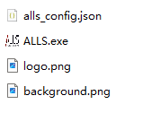

# 🌟 ALLS Launcher 使用说明

## 🧩 简介

我没活了

**ALLS Launcher** 是为 **ALLS 游戏环境** 设计的全屏启动引导程序，旨在提供一致的初始化体验。 

启动器将自动播放多阶段加载流程，自动查找并执行启动脚本，启动完成后自动退出。

本项目不提供任何游戏本体，请自行寻找游戏资源。

## 🎯 功能特点

- 🖥️ 全屏无边框界面，支持自适应客户机显示尺寸
- 🖼️ 支持自定义 **LOGO（`logo.png`）** 和 **背景图（`background.png`）**
- 🔄 可配置的动态加载动画与分阶段提示文本，各阶段可自定义停留时长和执行命令（例如启动游戏本体）
- ⌨️ 支持 `ESC` 键快速强制退出程序，支持自动拉起 `explorer.exe` 以适配 Shell 替换的环境

## 📦 使用方法

请前往 [Releases](https://github.com/NyaNyagulugulu/ALLS/releases/latest) 界面下载最新的程序资源包，该资源包已内置适用于 `SDEZ (ALLS HX2)` 的图片资源和配置文件。

### 1️⃣ 准备文件

请将以下文件放置在同一目录下：

- `ALLS.exe`（编译后的启动器主程序）  
- `logo.png`（LOGO 图标，推荐透明背景）  
- `background.png`（背景图片）  
- `alls_config.json`（配置文件）



然后使用记事本（或任何你喜欢的编辑器）打开 `alls_config.json` 文件，找到最下方的 `path` 字段，并改成你自己的游戏启动脚本目录，例如：

```json
{
    "step": 21,
    "text": "游戏程序准备中",
    "delay": 13000,
    "action": {
        "type": 1,
        "path": "D:\\SDEZ\\Package\\Start.bat" // 注意所有反斜线必须打两次，否则会被识别为转义字符
    }
}
```

### 2️⃣ 运行启动器

如果您没有大改 Stage 字段，那么双击运行 `ALLS.exe` 后，启动器将依次显示以下阶段：

- STEP 1 启动中
- STEP 4 网络设置中
- STEP 10 请连接安装工具
- STEP 21 游戏程序准备中

在显示 `STEP 21` 时，程序会执行你配置好的启动脚本。

### 3️⃣ 自动退出

在进入 `STEP 21` 阶段并启动了你配置的游戏启动脚本后，程序将等待约 **13 秒** ，然后自动退出。

如需强制退出，请按下 `ESC` 键。您也可以配置为其他行为，具体参见后面的 **配置文件** 部分。

## 🛠️ 编译说明

- 建议使用 **Visual Studio**，或支持 **C++17 及以上标准** 的 Windows 编译器
- 链接库需求：`Gdiplus.lib`
- 源码已内置所有功能，**无需额外依赖项**

## 🖼️ 界面预览

以下是实际运行界面截图：


## 🧸 配置文件

配置文件的示例和具体功能如下所示（如果你要复制粘贴，记得把所有注释删掉，程序本身不支持在配置文件中写注释）：

```json
{
  "model_text": "ALLS HX2",     // 显示在主界面的基板型号
  "esc_action": 1,              // 按下 ESC 后的行为。0 为什么也不做，1 是退出该程序，2 是退出该程序并启动 explorer.exe
  "show_cursor": false,         // 是否在该启动界面中显示鼠标
  "always_on_top": true,        // 是否让该启动界面始终保持在桌面最上层
  "background": {               // 有关背景的设置
    "path": "background.png",   // 背景图片的路径
    "size_h_override": 1,       // 背景图高度设置。override 为 0 时，不修改尺寸。当 override 大于 0 小于 10 时，将 bg 对应维度尺寸调整为 win 对应维度的倍数。当 override 大于等于 10 时，我们认为输入是绝对尺寸，直接用这个数值替换 bg 的对应维度
    "size_w_override": 0,       // 同 size_h_override，不过调整的是宽度设置
    "keep_image_ratio": true,   // 调整背景图大小时，是否保留原始图片的长宽比。如果宽和高的 override 都被设置了的话，该配置项将会被忽略
    "color": "0x000000"         // 背景图以外的背景颜色。例如 0xFFFFFF 就是纯白色
  },
  "logo": {
    "path": "logo.png"          // logo 图片的路径
  },
  "stages": [                   // 配置启动过程的阶段动画，以及每个阶段要干什么
    {
      "step": 1,                // 在 STEP 后面显示的数字
      "text": "启动中",         // 阶段显示的文字
      "delay": 1500             // 在该阶段停留多长时间（毫秒）
    },
    {
      "step": 4,
      "text": "网络设置中",
      "delay": 3200
    },
    {
      "step": 10,
      "text": "请连接安装工具",
      "delay": 2800
    },
    {
      "step": 21,
      "text": "游戏程序准备中",
      "wait_process": "Sinmai.exe",     // 等待指定进程启动
      "wait_window_title": "Sinmai",    // 等待指定标题的窗口出现
      "delay": 10000,           // 等待完上述两项以后，再停留多长时间
      "action": {               // 可以配置在该阶段开始时，要做哪些事情，例如启动指定的脚本
        "type": 1,              // action 类型，0 为什么也不做，1 为启动指定路径的脚本或程序
        "path": "start.bat"     // 当 type 为 1 时必须填写，脚本或程序的路径
      }
    }
  ]
}
```

## 🧸 命令行启动

您也可以通过命令行启动 ALLS.exe，这在您想配置 winlogon 时尤其有用。

> 注意：Winlogon 配置的默认工作目录为 `C:\Windows\System32`。如果您想通过 Winlogon 指定启动 ALLS.exe，则需要在启动时指定好配置文件路径，例如：
>
> ```cmd
> D:\ALLS\ALLS.exe --config D:\ALLS\alls_config.json
> ```
>
> 否则 ALLS.exe 由于读取不到正确的配置文件和资源文件，将会闪退。

## 🌟 关于

由 [小奶猫](https://github.com/NyaNyagulugulu) 编写，喵～如果喜欢这个启动器设计，欢迎喵喵一声 (｡･ω･｡)ﾉ♡

由 [AdemJensen](https://github.com/AdemJensen) 改进和优化喵，喜欢的话请多多给项目点点 Star 哦~
